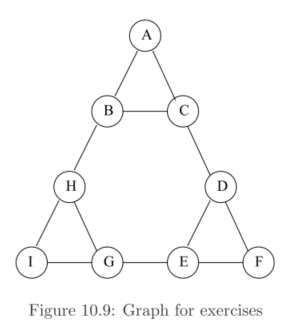
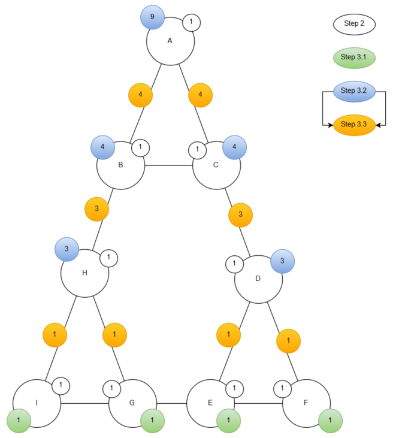
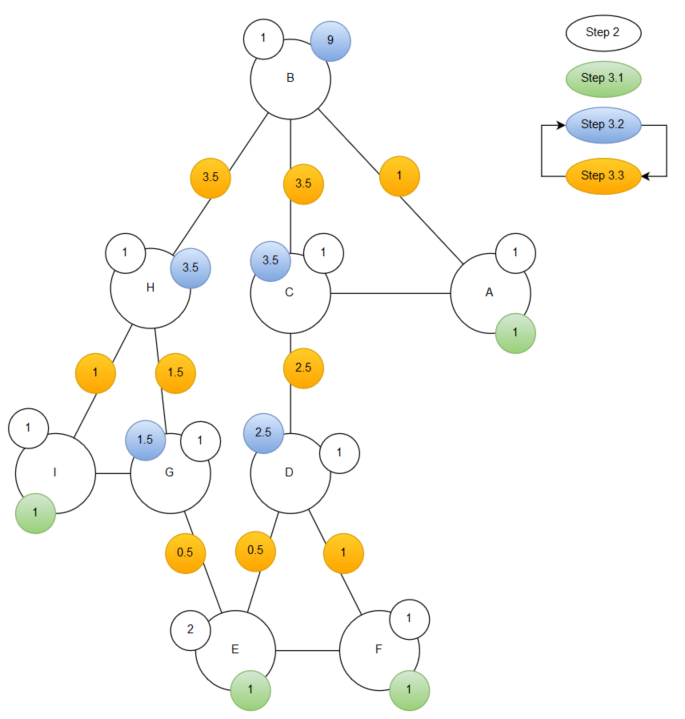
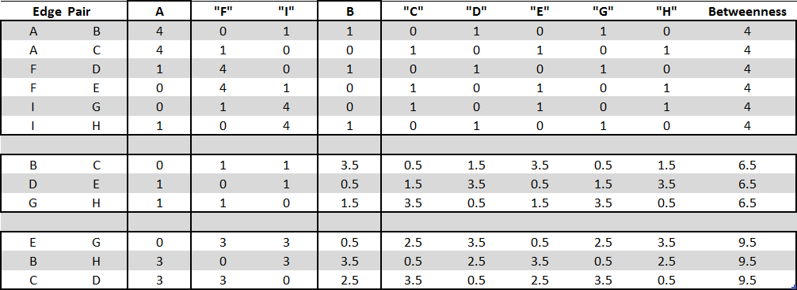

## 10.2.1 (section 10.2.6)
Figure 10.9 is an example of a social-network graph. Use the Girvan-Newman approach to find the number of shortest paths from each of the following odes that pass through each of the edges.

### 10.2.1 (a): A



### 10.2.1 (b): B



\pagebreak

## 10.2.2 (section 10.2.6)
Using symmetry, the calculations of Exercise 10.2.1 are all you need to compute the betweenness of  each edge. Do the calculation.



There are three groups of edges whose members, because of the symmetry of the network, will have the same betweenness. The actual calculations are shown for root nodes A and B. The rest of the root nodes are shown as place holders. The values in the place holder columns may not be exactly correct but taken together (again due to symmetry) the betweenness score for each edge is correct.

\pagebreak

## 10.4.1 (section 10.4.6)

For the graph of Fig. 10.9, construct:

### 10.4.1 (a)
The adjacency matrix.

```{r}
                   #A, B, C, D, E, F, G, H, I
adj_mat <- matrix(c(0, 1, 1, 0, 0, 0, 0, 0, 0,  #A
                    1, 0, 1, 0, 0, 0, 0, 1, 0,  #B
                    1, 1, 0, 1, 0, 0, 0, 0, 0,  #C
                    0, 0, 1, 0, 1, 1, 0, 0, 0,  #D
                    0, 0, 0, 1, 0, 1, 1, 0, 0,  #E
                    0, 0, 0, 1, 1, 0, 0, 0, 0,  #F
                    0, 0, 0, 0, 1, 0, 0, 1, 1,  #G
                    0, 1, 0, 0, 0, 0, 1, 0, 1,  #H
                    0, 0, 0, 0, 0, 0, 1, 1, 0), #I
                  nrow = 9, byrow = TRUE)

nodes <- unlist(strsplit("ABCDEFGHI", ""))
colnames(adj_mat) <- nodes
rownames(adj_mat) <- nodes

knitr::kable(adj_mat)
```


### 10.4.1 (b)
The degree matrix.

```{r}

                   #A, B, C, D, E, F, G, H, I
deg_mat <- matrix(c(2, 0, 0, 0, 0, 0, 0, 0, 0,  #A
                    0, 3, 0, 0, 0, 0, 0, 0, 0,  #B
                    0, 0, 3, 0, 0, 0, 0, 0, 0,  #C
                    0, 0, 0, 3, 0, 0, 0, 0, 0,  #D
                    0, 0, 0, 0, 3, 0, 0, 0, 0,  #E
                    0, 0, 0, 0, 0, 2, 0, 0, 0,  #F
                    0, 0, 0, 0, 0, 0, 3, 0, 0,  #G
                    0, 0, 0, 0, 0, 0, 0, 3, 0,  #H
                    0, 0, 0, 0, 0, 0, 0, 0, 2), #I
                  nrow = 9, byrow = TRUE)

colnames(deg_mat) <- nodes
rownames(deg_mat) <- nodes

knitr::kable(deg_mat)
```


### 10.4.1 (c)
The Laplacian matrix.

```{r}
lap_mat <- deg_mat - adj_mat

colnames(lap_mat) <- nodes
rownames(lap_mat) <- nodes

knitr::kable(lap_mat)
```


